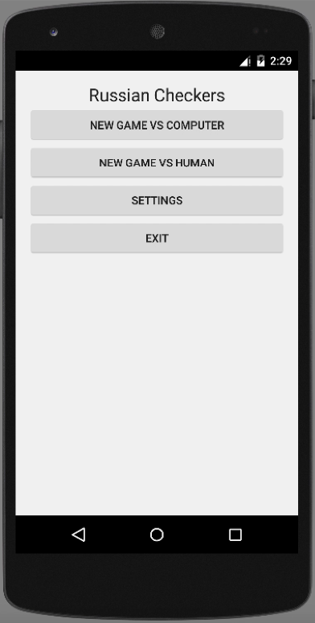
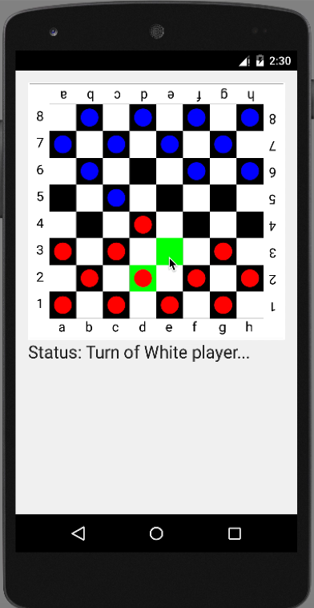
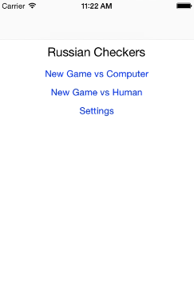
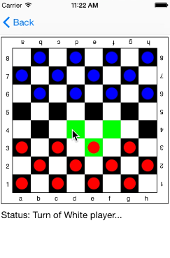

# README #

Russian Checkers is an Android/iOS checkers game that was written by Multi-OS Engine: https://multi-os-engine.org/

## Structure of the Russian Checkers ##

Schematically the project has the following structure:

```
<RussianCheckers>
|-- app
|  |-- src/main/java/com/intel/samples/russiancheckers/
|  |  |-- There is an Android GUI implementation
|-- common
|  |-- src/main/java/com/intel/core/
|  |  |-- There is implementations of game algorithms
|-- ios
|  |-- src/main/java/com/intel/russiancheckers/
|  |  |-- There is an iOS GUI implementation
```

In directories *app* and *ios* are specific implementations for different platforms. Directory *common* included implementation of game rules and game algorithms. The code from *common* directory is used in all platform specific implementations.

## Algorithms ##
Game is based on the rules of Russian version of checkers. More information can be find in [wiki](https://en.wikipedia.org/wiki/Russian_draughts).

For AI algorithm was used Alpha-Beta pruning algorithm. Read [wiki](https://en.wikipedia.org/wiki/Alpha%E2%80%93beta_pruning).

Also, user can select in main menu, what type of opponent he wants to play: AI or another man.

How it works, you can see on screenshots below.

## Screenshots ##
Main screen on Android:



Game screen on Android:



Main screen on iOS:



Game screen on iOS:


